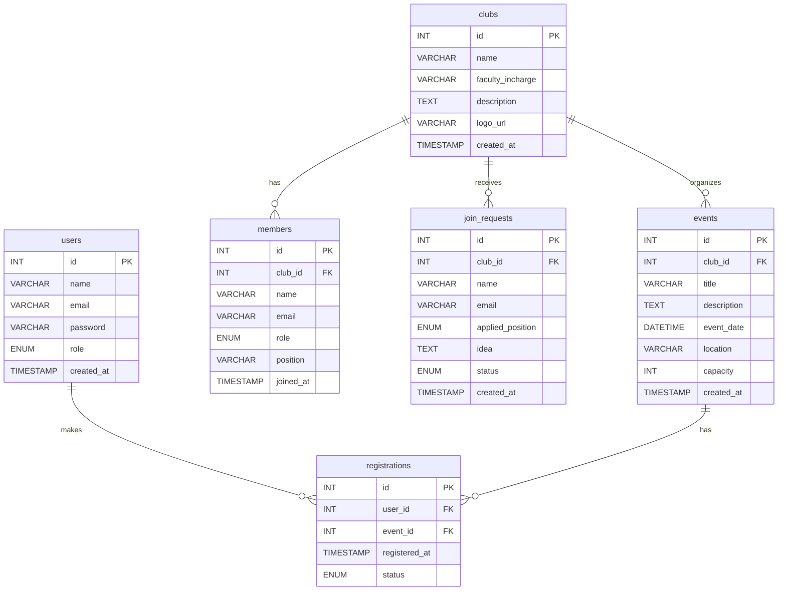

# Club Management System - ER Diagram

This document contains the Entity-Relationship (ER) diagram for the Club Management System database schema. It does not affect any project files.

## Relationships Details

- **clubs** to **members** (One-to-Many): A club can have many members, but each member record is tied to one specific club.
- **clubs** to **join_requests** (One-to-Many): A club can receive many join requests from prospective members.
- **clubs** to **events** (One-to-Many): A club can organize multiple events.
- **users** to **registrations** (One-to-Many): A user (student/admin) can make multiple registrations for different events.
- **events** to **registrations** (One-to-Many): An event can have multiple user registrations.
